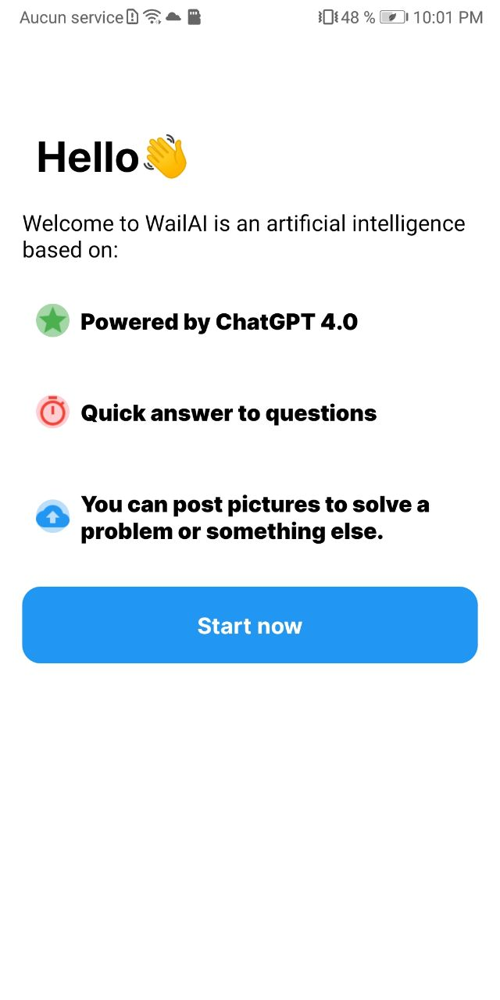
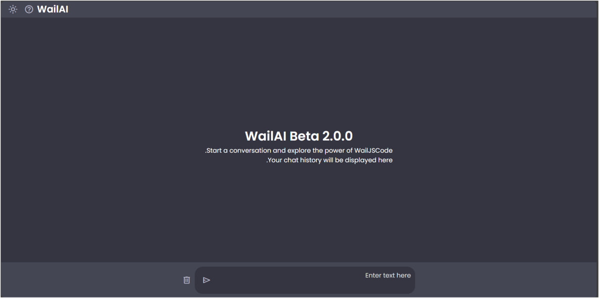
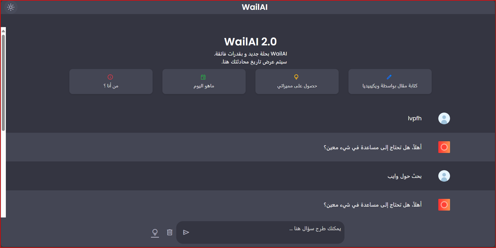

<!-- Project Logo -->
<p align="center">
  
</p>

<!-- Project Title -->
<h1 align="center">WailAI دليل استعمال</h1>

<!-- Project Description -->
<p align="center">
  <strong>المساعد أفضل الذي يعمل ب WailJSCode</strong>
</p>

<!-- Table of Contents -->
<p align="center">
  <a href="#مقدمة">مقدمة</a> •
  <a href="#أوامر">أوامر</a> •
  <a href="#تواصل">تواصل</a>
</p>

---

## مقدمة

يعتبر WailAI 2.0 نموذج الثاني بعد WailAI 1.X لأن تم ايقافه بسبب مشاكل في تطبيق لذا انهينا دعمه لأسف الشديد .لكن قمنا بتصميم نموذج أفضل اسمه WailAI 2.0 يعمل بواسطة WailJSCode بديل ChatGPT 4 صحيح قد يكون أفضل من WailJSCode لكننا نعمل جاهدا لتحسين قدراته.

## WailAI Wiki

- **تاريخ نشر:** 29 فيفري 2024
- **مالك:** WailTech
- **منتجات:** WailAI 1.X / WailAI 2.0 / WailJSCode
- **متوفر في:** Android (سابقا) / WebSite
- **أخر اصدار:** 2.0
- **أقدم اصدار:** 1.0
- **نوع موقع:** موقع AI
- **بلد المنشأ:** الجزائر
- **موقع:** https://wailapp.github.io/wailai/
- **تم كتابته ب:** Html /CSS /JS /(من أجل WailAi 1.0 )Java
- **شعار:**
  <p align="center">
  
</p>
  <p align="center">
  WailAI 2.0 (2024)
</p>

  <p align="center">
  
</p>
  <p align="center">
  WailAI 1.X (Old)
  </p>

  - **لقطات من صور**
 <p align="center">
    <p align="center">
  
</p>
  <p align="center">
  WailAI 1.X (Android)
  </p>
      <p align="center">
  
</p>
  <p align="center">
  WailAI 2.0 (beta)
  </p>
        <p align="center">
  
</p>
  <p align="center">
  WailAI 2.0
  </p>
  </p>
  
## أوامر
في هذا المقال تجد:

## أوامر WailJSCode (تحديث 01)

**لبدء محادثة أكتب مثلا**
```bush
مرحبا
```
**لكتابة مقال من ويكيبديا أكتب**
```bush
اكتب مقال عن ( اسم المقال الذي تريده )
```
**حساب**
```bush
حساب (عملية التي تريج حسابها )
```
## أوامر WailJSCode (تحديث 02)

**بحث في جوجل (Google)**
```bush
بحث عن  ( بحث الذي تريده )
```
**أخبار**
```bush
أخبار
```
## أوامر WailJSCode (تحديث 03)

**طقس**
```bush
طقس في (اسم بلد أو منطقة)
```
**نكتة**
```bush
نكتة
```
```bush
ما هو اليوم
```
```bush
أين أنا
```
```bush
كيف الحال
```

## أوامر WailJSCode (تحديث 04)

**ماذا يفعل WailAI**
```bush
ما هي وظيفتك

ماذا تفعل

ما تستطيع القيام به
```

**عطف**
```bush
أحبك, حبيبي, حبي,أمور, ❤️, 😘, 💕
```

**أسئلة أخرى في تحديث**

```bush
هل أنت متزوج
كم عمرك
متى عيد ميلادك
غني لي أغنية عيد ميلاد
```

## جرب الأن WailAI:

https://wailapp.github.io/wailai

## تواصل
تواصل معنا عبر:
- **تيليغرام:** https://t.me/+cT7qv58VYrAxNTJk
- **البريد الالكتروني:** gamesup648@gmail.com

**هذا مشروع <a href="https://github.com/WailApp/wailai/tree/main">مصدر مفتوح </a> يمكن تحميله و تعديله باتباع <a href="LICENSE">شروط و أحكام</a>.**

WailTech for WailApp 2019-2024
